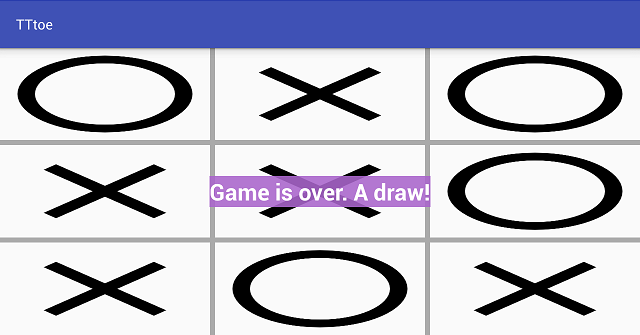

TTtoe
======

This application is a tic-tac-toe game. This is about how I reconciled Vector Drawables & screenOrientation;

Це про те, як я примирив Vector Drawables & screenOrientation;

Это о том, как я примирил Vector Drawables & screenOrientation.

"... using vector-based images, you will need only one asset file as opposed to an asset file for each screen density in the case of bitmap images."

Pre-requisites
---------------

	* Android SDK v26
    * Android Build Tools v27.0.1
    * Android Support Repository v47.0.0
    * Google Repository v58

Getting Started
----------------

This sample uses the Gradle build system. To build this project, use the "gradlew build" command or use "Import Project" in Android Studio.

Screenshot
-----------

